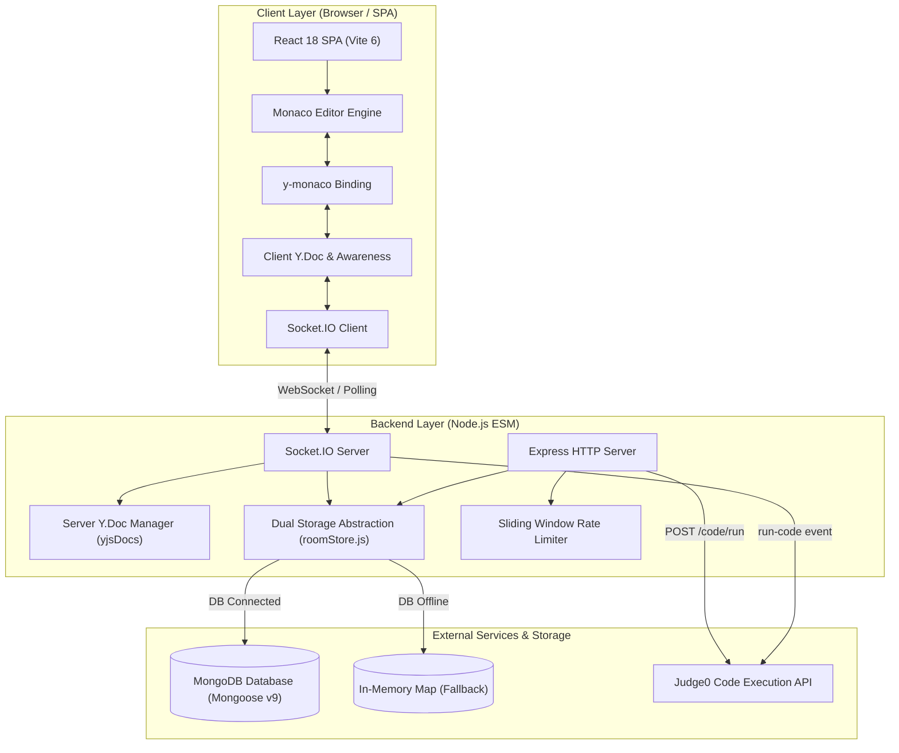
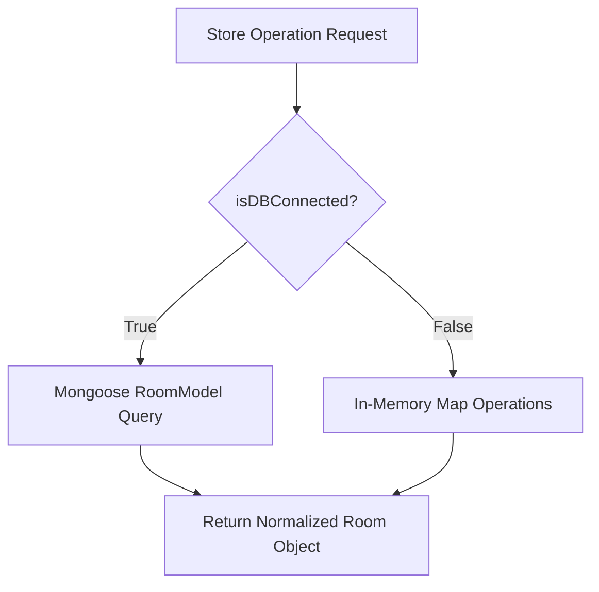
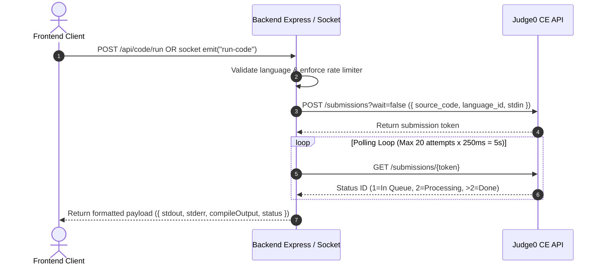

# System Architecture — InterviewPad

## 1. High-Level System Architecture

InterviewPad follows a client-server architecture utilizing **React 18** on the frontend, **Node.js/Express + Socket.IO** on the backend, **Yjs CRDTs** for real-time state synchronization, **MongoDB** (with in-memory fallback) for persistence, and **Judge0 CE** for isolated code execution.



---

## 2. Tech Stack Specification

| Component | Technology | Version | Key Responsibilities |
|---|---|---|---|
| **Frontend Framework** | React | `^18.3.1` | UI render, state management, component tree |
| **Frontend Build Tool** | Vite | `^6.2.0` | Development server, JSX bundling |
| **Code Canvas** | Monaco Editor | `^4.6.0` | VS Code editing engine, syntax highlighting, decorations |
| **CRDT Engine** | Yjs | `^13.6.31` | Shared text model (`Y.Text`), conflict-free delta generation |
| **Monaco Binding** | `y-monaco` | `^0.1.6` | Two-way binding between `Y.Text` and Monaco Editor Model |
| **Presence Engine** | `y-protocols` | `^1.0.7` | User awareness state, remote selection, cursor positions |
| **Real-Time Client** | `socket.io-client` | `^4.8.1` | WebSocket connection, reconnection loops |
| **Backend Runtime** | Node.js (ESM) | ES Modules (`"type": "module"`) | Asynchronous IO execution |
| **Web Server** | Express | `^4.21.2` | REST endpoints, static file serving, CORS enforcement |
| **Real-Time Server** | Socket.IO | `^4.8.1` | Event routing, room broadcasting, socket lifecycle |
| **ORM / ODM** | Mongoose | `^9.6.2` | MongoDB object modeling, document persistence |
| **Auth & Security** | `jsonwebtoken` / `bcryptjs` | `^9.0.3` / `^3.0.3` | JWT issuance/verification, password hashing (12 rounds) |
| **Code Runner API** | Judge0 CE API | External REST | Sandboxed compilation and code execution |

---

## 3. Dual-Storage Engine Architecture (`roomStore.js`)

To prevent application crashes when MongoDB is unavailable, InterviewPad implements a **Dual-Storage Abstraction Layer** in `backend/src/store/roomStore.js`.



* **MongoDB Mode**: When connected, read and write operations use atomic Mongoose queries (`$addToSet`, `$pull`, `$push`, `$inc`, `findOneAndUpdate`).
* **In-Memory Mode**: When offline, data is stored in `memoryRooms: Map<roomId, roomObject>`. Chat history is automatically capped at 200 messages per room to manage memory footprint.

---

## 4. Real-Time Socket.IO Protocol Specification

### 4.1 Room & Document Events
| Event Name | Direction | Payload Structure | Description |
|---|---|---|---|
| `join-room` | Client $\rightarrow$ Server | `{ roomId, username, lastSeenMessageId }` | Client joins room, receives room state, Yjs snapshot, and missed chat |
| `room-state` | Server $\rightarrow$ Client | `{ roomId, code, language, users, host, question, messages }` | Full room initialization metadata broadcast |
| `yjs-sync-full` | Server $\rightarrow$ Client | `{ update: Base64String }` | Transmits full encoded Y.Doc state snapshot |
| `yjs-update` | Bidirectional | `{ roomId, update: Base64String }` | Incremental CRDT delta update broadcast to peer sockets |
| `yjs-awareness` | Bidirectional | `{ roomId, update: Base64String }` | Remote cursor and selection state synchronization |
| `yjs-sync-request` | Client $\rightarrow$ Server | `{ roomId }` | Requests a full state vector update upon reconnect |

### 4.2 Control & Communication Events
| Event Name | Direction | Payload Structure | Description |
|---|---|---|---|
| `set-language` | Client $\rightarrow$ Server | `{ roomId, language }` | Changes room programming language |
| `language-update` | Server $\rightarrow$ Client | `languageString` | Broadcasts language change to room |
| `question-change` | Client $\rightarrow$ Server | `{ roomId, question }` | Host edits problem description |
| `question-update` | Server $\rightarrow$ Client | `questionString` | Broadcasts updated question text |
| `reset-room` | Client $\rightarrow$ Server | `{ roomId }` | Resets editor text to default boilerplate and clears Y.Doc |
| `chat-message` | Client $\rightarrow$ Server | `{ roomId, text }` | Submits chat message |
| `chat-update` | Server $\rightarrow$ Client | `{ id, sender, text, timestamp }` | Broadcasts stored message to room |
| `chat-typing` | Client $\rightarrow$ Server | `{ roomId, isTyping: boolean }` | Emits typing state |
| `run-code` | Client $\rightarrow$ Server | `{ roomId, sourceCode, language, stdin }` | Triggers code execution |
| `run-result` | Server $\rightarrow$ Client | `{ stdout, stderr, compileOutput, status }` | Emits execution output to trigger socket |

---

## 5. Database Schema Definitions

### 5.1 User Schema (`backend/src/models/User.js`)
```javascript
{
  username:     { type: String, required: true, unique: true, trim: true },
  email:        { type: String, required: true, unique: true, lowercase: true },
  passwordHash: { type: String, required: true },
  timestamps:   true
}
```

### 5.2 Room Schema (`backend/src/models/Room.js`)
```javascript
{
  roomId:   { type: String, required: true, unique: true, index: true },
  users:    [{ type: String }],
  host:     { type: String, required: true },
  question: { type: String, default: "" },
  code:     { type: String, default: "# Write your solution here\n" },
  language: { type: String, default: "cpp" },
  version:  { type: Number, default: 0 },
  messages: [{
    sender:    { type: String, required: true },
    text:      { type: String, required: true, maxlength: 2000 },
    timestamp: { type: Date, default: Date.now }
  }],
  timestamps: true
}
```

---

## 6. Judge0 Code Execution Pipeline


