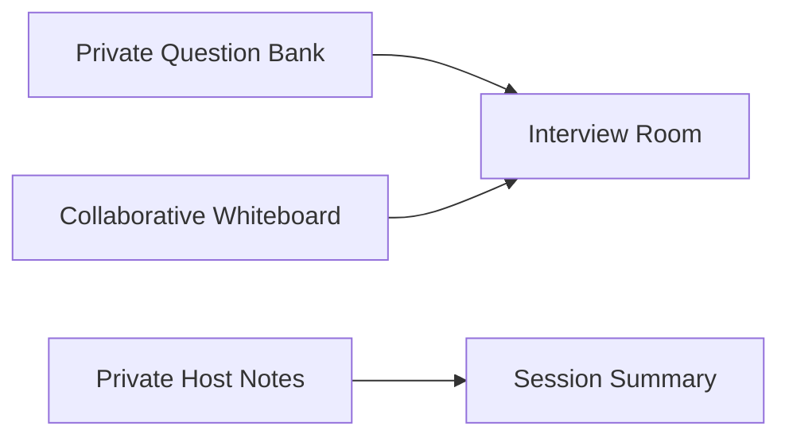
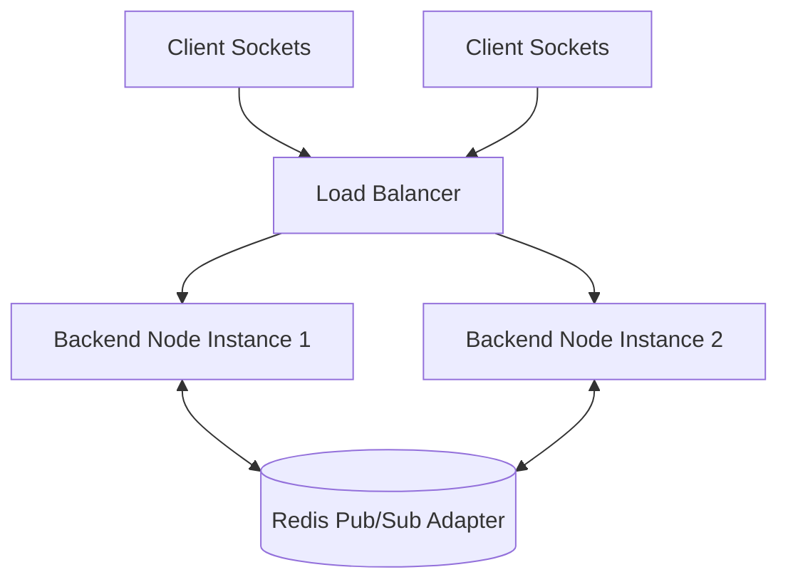

# Product Roadmap & Development Phases — InterviewPad

This document outlines the multi-phase evolution of **InterviewPad**, from its current MVP baseline to enterprise-scale features.

---

## Phase 1: Core Foundation & MVP (Completed)

### Objectives
Establish a robust, low-latency collaborative coding platform with multi-language execution, real-time presence, and resilient fallback storage.

### Deliverables
* [x] **Authentication & Access**: JWT-based interviewer registration/login + zero-login Guest join mode.
* [x] **Real-Time CRDT Editor**: Monaco Editor integration with Yjs (`y-monaco` and `y-protocols/awareness`) for conflict-free multi-user code editing and colored cursor presence.
* [x] **Sandboxed Code Execution**: Integration with Judge0 CE API supporting C++, Java, and Python with structured output tabs (`stdout`, `stderr`, `compileOutput`).
* [x] **Dual-Storage Resilience**: Hybrid `roomStore.js` persistence engine supporting MongoDB with automatic fallback to an in-memory `Map` when offline.
* [x] **Reconnection & Grace Period**: 60-second disconnect buffer preventing instant user drop on network jitter; automatic Yjs state vector and chat catch-up on socket re-join.
* [x] **In-App Communication**: Socket-driven room chat with typing indicators and unread notification badges.

---

## Phase 2: Interviewer Superpowers (Near-Term Roadmap)

### Objectives
Provide interviewers with automated tools to evaluate candidate problem-solving efficiency and system design capabilities.

### Planned Features

1. **Private Question Bank & Automated Test Cases**
   * Pre-load DSA questions tagged by difficulty (Easy, Medium, Hard) and topic (Graphs, Dynamic Programming, Trees).
   * Hidden test case execution: Run candidate code against secret test cases without exposing inputs to the candidate browser console.
2. **Integrated Collaborative Whiteboard**
   * Embed Excalidraw canvas tab alongside the code editor for system design and architecture interviews.
   * Real-time vector drawing synchronization over dedicated Socket.io room channels.
3. **Private Host Notes Panel**
   * Dedicated Markdown note panel for interviewers, completely hidden from candidate screens.
   * Auto-saved to database and attached to final interview evaluation records.

---

## Phase 3: Infrastructure Scaling & Security (Mid-Term)

### Objectives
Scale the platform architecture horizontally and optimize code execution security and cost efficiency.

### Planned Infrastructure Upgrades

1. **Horizontal Scaling with Redis Adapter**
   * Implement `@socket.io/redis-adapter` to distribute room connections across multiple Node.js server instances behind a Load Balancer.
2. **Client-Side Wasm Execution Sandbox (Pyodide / WebAssembly)**
   * Offload lightweight Python and C++ executions directly to WebAssembly inside candidate browsers for zero server execution cost and sub-10ms response times.
3. **Toggleable Intellisense & Autocomplete**
   * Allow interviewers to toggle autocomplete, syntax suggestions, and auto-bracket completion on/off in real-time to test raw candidate syntax recall.

---

## Phase 4: Enterprise Monetization & Analytics (Long-Term)

### Objectives
Deliver enterprise-grade interview review workflows, hiring manager analytics, and ATS integration.

### Planned Enterprise Features
1. **Keystroke Replay Engine**
   * Record the sequential time-series stream of Yjs CRDT deltas (`Y.encodeStateAsUpdate`).
   * Video-player style UI scrubber (1x, 2x, 4x speed) allowing hiring managers to replay the exact sequence of candidate keystrokes, edits, and refactoring decisions.
2. **Standardized Evaluation Rubrics & Scorecards**
   * Custom scorecard builder (Code Quality, Algorithmic Complexity, Communication, Problem Solving).
   * Require completed scorecard before permanently archiving interview rooms.
3. **Applicant Tracking System (ATS) Integrations**
   * Bi-directional OAuth integrations with Greenhouse, Lever, and Workday.
   * Automatically attach completed code snapshots, interviewer notes, and playback links to candidate ATS profiles upon session completion.
